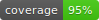

# Assert Laravel

[](https://packagist.org/packages/yormy/assert-laravel)
[](https://packagist.org/packages/yormy/assert-laravel)



Assert helpers for developing tests

## Installation

You can install the package via composer:

```bash
composer require yormy/assert-laravel
```

## Changelog

Please see [CHANGELOG](CHANGELOG.md) for more information on what has changed recently.

## Contributing

Please see [CONTRIBUTING](.github/CONTRIBUTING.md) for details.

## Security Vulnerabilities

Please review [our security policy](../../security/policy) on how to report security vulnerabilities.

## Credits

- [yormy](https://github.com/yormy)
- [All Contributors](../../contributors)

## License

The MIT License (MIT). Please see [License File](LICENSE.md) for more information.
